# Diagrama de Entidades e Relacionamentos - OS.Tech

## Visão Geral

Este documento apresenta o diagrama ER (Entidade-Relacionamento) do sistema OS.Tech, modelado em Mermaid, contemplando todas as entidades, atributos, chaves primárias, chaves estrangeiras e seus relacionamentos.

## Diagrama ER em Mermaid

```mermaid
erDiagram
    CLIENTE {
        int id PK "ID do Cliente"
        string nome "Nome completo"
        string cpf "CPF"
        string rg "RG"
        string telefone "Telefone"
        string whatsapp "WhatsApp"
        string email "E-mail"
        string endereco "Endereço"
        string observacoes "Observações"
        date dataCadastro "Data de cadastro"
        boolean ativo "Ativo"
    }

    EQUIPAMENTO {
        int id PK "ID do Equipamento"
        int clienteId FK "ID do Cliente"
        string etiqueta "Etiqueta"
        string tipo "Tipo"
        string marca "Marca"
        string modelo "Modelo"
        string numeroSerie "Número de Série"
        string observacoes "Observações"
        date dataCadastro "Data de cadastro"
        boolean ativo "Ativo"
    }

    ORDEM_SERVICO {
        int id PK "ID da OS"
        string numeroOS "Número da OS"
        int clienteId FK "ID do Cliente"
        int equipamentoId FK "ID do Equipamento"
        string status "Status"
        date dataEntrada "Data de entrada"
        date dataPrevisao "Data de previsão"
        date dataConclusao "Data de conclusão"
        string observacoes "Observações"
    }

    EVENTO_OS {
        int id PK "ID do Evento"
        int osId FK "ID da OS"
        int usuarioId FK "ID do Usuário"
        datetime dataHora "Data e hora"
        string descricao "Descrição"
    }

    SERVICO {
        int id PK "ID do Serviço"
        string descricao "Descrição"
        decimal valorPadrao "Valor padrão"
        boolean ativo "Ativo"
    }

    PECA {
        int id PK "ID da Peça"
        string descricao "Descrição"
        string fabricante "Fabricante"
        decimal valorReferencia "Valor de referência"
        boolean ativo "Ativo"
    }

    ITEM_OS {
        int id PK "ID do Item"
        int osId FK "ID da OS"
        string tipoItem "Tipo (SERVICO/PECA)"
        int referenciaId FK "ID de referência"
        string descricao "Descrição"
        decimal quantidade "Quantidade"
        decimal valorUnitario "Valor unitário"
        decimal valorTotal "Valor total"
    }

    INVENTARIO {
        int id PK "ID do Inventário"
        int osId FK "ID da OS"
        datetime dataCaptura "Data da captura"
        json jsonCompleto "JSON completo"
    }

    USUARIO {
        int id PK "ID do Usuário"
        string nome "Nome"
        string login "Login"
        string senhaHash "Hash da senha"
        string perfil "Perfil"
        boolean ativo "Ativo"
    }

    CLIENTE ||--o{ EQUIPAMENTO : "possui"
    CLIENTE ||--o{ ORDEM_SERVICO : "solicita"
    EQUIPAMENTO ||--o{ ORDEM_SERVICO : "referente a"
    ORDEM_SERVICO ||--o{ EVENTO_OS : "registra"
    ORDEM_SERVICO ||--o{ ITEM_OS : "contém"
    ORDEM_SERVICO ||--|| INVENTARIO : "possui"
    SERVICO ||--o{ ITEM_OS : "referenciado em (tipoItem=SERVICO)"
    PECA ||--o{ ITEM_OS : "referenciado em (tipoItem=PECA)"
    USUARIO ||--o{ EVENTO_OS : "registra"
```

## Legenda de Cardinalidade

| Notação | Significado |
|---------|-------------|
| `\|\|` | Exatamente um (1) |
| `o{` | Zero ou muitos (0..N) |
| `\|\|{` | Um ou muitos (1..N) |

## Relacionamentos Detalhados

| Pai | Filho | Cardinalidade | FK no Filho | Descrição |
|-----|-------|---------------|-------------|-----------|
| Cliente | Equipamento | 1:N | clienteId | Um cliente possui vários equipamentos |
| Cliente | OrdemServico | 1:N | clienteId | Um cliente solicita várias OS |
| Equipamento | OrdemServico | 1:N | equipamentoId | Um equipamento pode ter várias OS |
| OrdemServico | EventoOS | 1:N | osId | Uma OS registra vários eventos |
| OrdemServico | ItemOS | 1:N | osId | Uma OS contém vários itens |
| Servico | ItemOS | 1:N | referenciaId (tipoItem=SERVICO) | Um serviço pode estar em vários itens |
| Peca | ItemOS | 1:N | referenciaId (tipoItem=PECA) | Uma peça pode estar em vários itens |
| OrdemServico | Inventario | 1:1 | osId | Cada OS possui no máximo um inventário (captura única) |
| Usuario | EventoOS | 1:N | usuarioId | Um usuário registra vários eventos |

## Notas sobre ItemOS

A entidade `ItemOS` utiliza um padrão de **polimorfismo por referência** (tabela de junção genérica):

- `tipoItem` define se o item refere-se a um `SERVICO` ou `PECA`
- `referenciaId` armazena a FK para a tabela correta conforme `tipoItem`

Este design permite que uma OS contenha tanto serviços quanto peças em uma única estrutura flexível.
